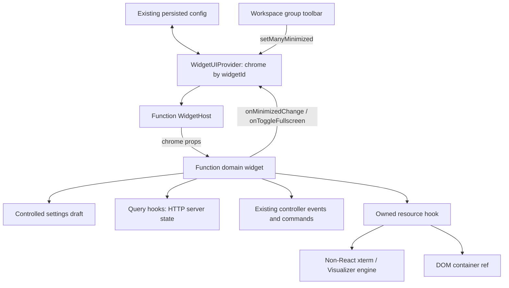

# CNCjs next UI 遷移設計

## 目標與範圍

把 `src/app` 內仍使用的舊 UI primitives 轉成 Tonic UI v2 直接 imports；刪除重複元件與其專屬樣式。全部 React class components 改 function components，含 HOC、Workspace 和 deprecated 目錄中的遺留。無 consumers 的遷移目標可以直接移除；無關 dead code 不清理。

保留 CNCjs 的 domain composition：Widget 結構、長按指令行為、表格資料邏輯、code preview、iframe/webcam lifecycle。保留不等於不升級：外層 UI 一樣用 Tonic、React 一樣用 function。單纯 Box/Button/Input 轉接不是 domain composition，應刪除。完整家族決策見 inventory。

目前 lockfile 解出的 React 18.3.1 / Tonic 2.15.0 / Query 4.44.0 是這輪相容性基線。保留 package.json 既有 semver policy；只有 React Query 從 devDependencies 移到 dependencies 是必要 manifest 變更。不要順便把所有套件改成 exact pins，也不要用絕對本機 file dependency／yarn link；本機 repo 只作 API 參考，lockfile 負責可重現安裝。

## 架構與責任

- `context.jsx` 延用單一 QueryClient 與現有 Tonic/Redux providers，不替每個 widget 新建 client。
- `src/app/queries/macros.js` 提供跨 Administration/Macro 的共用 hooks；原 Administration 路徑只做暫時 re-export，所有 consumers 遷移後刪除舊檔。
- 其餘 server-state hooks 放在各 widget 的 `queries.js`；跨 widget 的 G-code HTTP mutation 放 `src/app/queries/gcode.js`，保留既有 API transport 與 payload。
- 既有 Redux、controller、PubSub 維持即時機器狀態唯一來源，不把位置串流／run/pause/jog 改成輪詢或 queryFn。
- `src/app/pages/Workspace/WidgetUIProvider.jsx` 以 widgetId 管理 fullscreen，並訂閱 config 中的 minimized；WidgetHost 傳 controlled chrome props，Workspace toolbar 直接 dispatch。Axes/Tool/Autolevel/Visualizer 的 domain state 各自保留，不做萬用 widget reducer。
- Widget shell 是 domain composition，允許保留 `Widget.Header` 等結構；Buttons/Dropdown/Modal/GridSystem 等通用元件的最終 consumers 必須直接依賴 Tonic。
- Font Awesome 是現有圖示資產，不是本輪要淘汰的 UI component library；保留 `@fortawesome/*` 與既有 glyph，避免把視覺資產替換混入 class/query/widget 架構重構。只有新增的 Tonic control 已有一對一圖示且不改語意時可就地採用 Tonic icon。全面圖示統一另開工作。
- `styled-components` 不符合此 repo 的 Stylus 慣例。每個被本輪觸及的 styled component 改成 Tonic style props 或 colocated Stylus；W3 要求 `src/app` 零 `styled-components` imports，確認最後 consumer 清空後才移除套件。
- `portal.jsx` 現在建立額外 React root，但 GlobalProvider 使用模組級 queryClient，cache 已共用。此輪先修正 createRoot import 並驗證共享 client；不強迫改造全域 modal orchestration。Tonic Portal 自動處理 modal DOM portal，不能誤以為 PortalManager 會繼承另一個 React root 的 widget context。

## 不可破壞的行為

1. Workspace 排序、fork/remove、default/primary/secondary widget 名單與 local settings keys 不變。
2. 消除 `collapse()` / `expand()`、widgetMap 與 component instance refs。02 統一改 controlled chrome props；收合只隱藏內容，不卸載 terminal、controller subscriptions 或 canvas。DOM refs 與 xterm/renderer 資源 refs 可保留，不能以 useImperativeHandle 重建 class instance。
3. `setState` merge 語意不能被 hooks 的 replacement 語意取代。原有依賴最新值的事件用 functional setter 或最新 callback/ref；不能把有副作用的 controller 指令放進 state updater、render、useMemo。
4. 每個事件 listener、PubSub token、timer、resize observer、RAF、xterm／WebGL 資源有單一 owner，effect cleanup 對應 setup，快速 mount/unmount 不累加。
5. 連線、workflow、machine state、units、jog distance/feed、laser/spindle power 的 gate/payload 不變；長按 release、失焦、disabled 和 unmount 不可繼續送指令。
6. HTTP mutation 不自動 retry，不因 rerender/refetch 重送操作；讀取 query 可以取消，取消不代表已送出的 mutation 可復原。
7. Query v4 使用 `isLoading/isFetching/isError` 與 `cacheTime`（需要時）；不要抄 v5 的 `isPending/gcTime`。
8. 自訂样式沿用 Stylus；Tonic 提供的 layout/theme props 直接使用。遷移完成刪舊 stylus 時，先確認無間接 selector 依賴。

Effect setup/cleanup 的依據為 [React useEffect 官方文件](https://react.dev/reference/react/useEffect)。Query cancellation 要把 signal 傳到 transport，參考 [Query v4 cancellation](https://tanstack.com/query/v4/docs/framework/react/guides/query-cancellation)；成功寫入後更新相關 cache，參考 [Query v4 invalidation](https://tanstack.com/query/v4/docs/framework/react/guides/invalidations-from-mutations)。

## Tonic API 核對入口

本機 `/home/cheton/Code/trendmicro-frontend/tonic-ui-v2/`：

- `packages/react/package.json`：版本、peers、runtime dependencies。
- `packages/react/src/index.js`：公開 component exports。不要引用 `deprecated/` 或假設 Chakra/MUI 元件名。
- `packages/react/src/{button,checkbox,menu,modal,grid,select,tabs,table,pagination,tooltip,toast,tree}/`：props、ref、callbacks。
- `packages/react-docs/pages/components/`：可照用的 composition examples。
- `packages/react-hooks/src/index.js`、`packages/react-icons/src/index.js`、`packages/theme/`：共用 hooks、圖示、tokens。

已確認：Tonic 有 `MenuButton/MenuList/MenuItem`、`ModalOverlay/ModalContent/ModalHeader/ModalBody/ModalFooter`、`Grid`、`Tabs/TabList/Tab/TabPanels/TabPanel`。**沒有理由繼續實作本地 Dropdown/Modal/GridSystem/Navs。**

Tonic Modal 2.15 的 `autoFocus/ensureFocus/closeOnEsc/closeOnInteractOutside` 預設 false，要根據原 dialog 的行為明確設定。Checkbox 的 `ref` 與 `inputRef` 不等價，舊 `.checked` consumers 改成受控狀態或 inputRef。Menu 舊 `eventKey` 改成每個 MenuItem 的 onClick；不要把舊 props 原樣灌進 DOM。

## 第三方 UI 決策（不可留到實作時臨場選擇）

| 現有套件 | 本輪決策 | 實作位置／完成條件 |
| --- | --- | --- |
| `react-select` | 以 Tonic `Select` 取代 | Connection、Tool、Webcam settings；保留 option value、placeholder、clear/disabled 與 validation 行為 |
| `rc-slider` | 以 Tonic `Slider` 取代 | Axes MDI create/update、ShuttleXpress、Laser、Webcam；先保存 min/max/step/value label 與 change/commit 觸發時機 |
| `rc-trigger` | 以 Tonic Tooltip/Popover 取代 | 本地 Tooltip/Infotip 最後 consumer 清空後刪除 |
| `react-repeatable` | 移除套件，保留 CNC 長按 domain hook | `RepeatableButton` 底層用 Tonic Button；delay、interval、pointer/key release、blur、disabled、unmount 全部有 fake-timer tests |
| `react-infinite-tree` | 預設改 Tonic `Tree` | WatchDirectory 使用 controlled `expanded`/`selected` 和 Query lazy loading；只有 R0 固定大目錄 fixture 在相同 browser 的 p95 退步超過 20% 時，才新增只負責可視列計算的薄 virtualization adapter，Tree selection/loading state 仍由 React owner 管理 |
| `react-datepicker` | 本輪保留 | Tonic v2 無一對一 date picker；既有日期輸入不因 UI 清理被降級，另開替換工作 |
| `react-foreach` | 改原生 `map` | Axes Settings General；不保留 wrapper dependency |
| `styled-components` | 移除 | 觸及檔案改 Tonic props 或 Stylus；W3 負向掃描為零後移除 dependency |
| `@fortawesome/*` | 保留 | 不屬於本輪 legacy component package 清理 |

Query 的允許邊界、非 hook caller 及靜態掃描規則見 [03b](details/03b-query-boundaries.md)；元件家族拆批見 [08a](details/08a-component-families.md)。

## 分期完成定義

每期：指定區域無新 legacy imports、指定 React classes 清空、功能測試成功、build/lint 結果可追溯、同一個流程無重複指令或 listener。

最終：所有 17 widgets 和 Workspace 完成（16 個有 chrome，Visualizer 保留無 chrome）；src/app 的 React classes 為零；createFetchMachine/ServiceContext fetch actor 為零；沒有 legacy UI package imports；inventory 的「直接替換」家族全部移除；只保留經逐項證明具 domain 功能的 composition；`styled-components` imports 為零。Font Awesome 與 `react-datepicker` 按上表保留。重新 `yarn install --immutable` 可重現，Node/backend 測試仍過。

## Widget 架構的最終資料流

State ownership 必須有單一來源：minimized 在既有 config，fullscreen 在 Workspace provider，設定草稿在表單 owner，server data 在 Query，機器狀態在既有 Redux/controller，renderer 資源在本 widget hook。避免把所有 state 搬到 Workspace，也不新增可呼叫任意 widget method 的 global event bus。既有 WidgetEventProvider 只在本來需要的 domain 範圍使用，不能作為 component instance registry 的變體。

## 細化文件與驗證優先順序

[02a Widget state](details/02a-widget-state.md)、[06a Settings](details/06a-controlled-settings.md)、[07a Visualizer engine](details/07a-visualizer-engine.md) 固定細部介面；父計畫只作階段索引。若後續 source 變更造成不一致，先更新對應 contract/test，不能自行改回 component instance API。

[09 Regression gates](09-regression-gates.md) 是 U1、V2/V3 的必要 gate。已有 [幾何基線](geometry-baseline.json) 是本次以真 parser/Three.js 對原 source 的只讀量測，不能代替 browser/GPU、controller 或 lifecycle tests。
